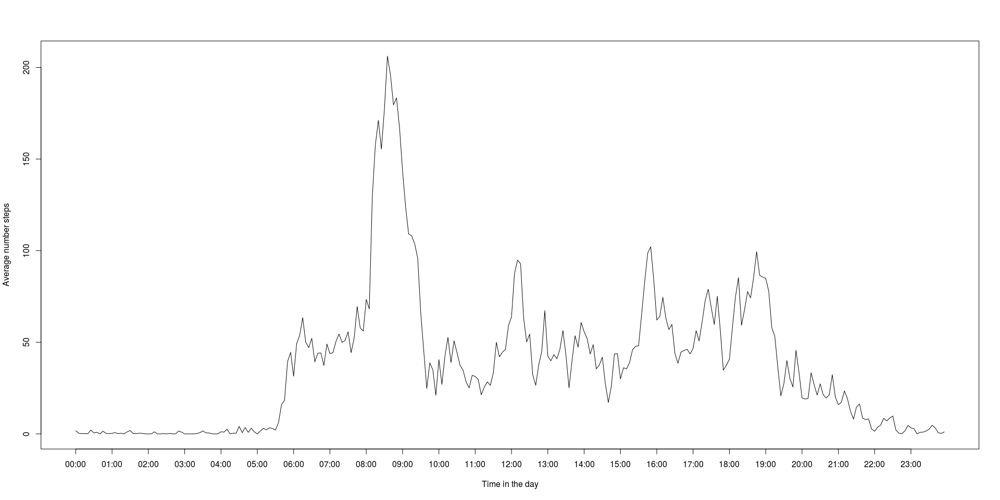

# Reproducible Research: Peer Assessment 1


## Loading and preprocessing the data

1. **Load the data (i.e. read.csv())**  

```r
unzip("activity.zip", "activity.csv")
ActivityData <- read.csv("activity.csv", header=T)
```

2. **Process/transform the data (if necessary) into a format suitable for your analysis**  

```r
# Convert to date
ActivityData$date <- as.Date(ActivityData$date,format="%Y-%m-%d")
# Convert interval to time
ActivityData$time <- sprintf("%04d", ActivityData$interval)
ActivityData$time <- format(strptime(ActivityData$time, format="%H%M"), format = "%H:%M")
```

## What is mean total number of steps taken per day?  

1. **Calculate the total number of steps taken per day**  

```r
StepsPerDay <- with(ActivityData, tapply(steps,date,sum,na.rm=TRUE))
```

2. **Make a histogram of the total number of steps taken each day**  

```r
hist(StepsPerDay)
```

<!-- -->

3. **Calculate and report the mean and median of the total number of steps taken per day**  

```r
MeanStepsPerDay <- mean(StepsPerDay,na.rm=TRUE)
MedianStepsPerDay <- median(StepsPerDay,na.rm=TRUE)
```

The average number of total steps taken each day between October 01 and November 30, 2012 was 9354.2295082 with a median of 10395.

## What is the average daily activity pattern?  

1. **Make a time series plot (i.e. type = "l") of the 5-minute interval (x-axis) and the average number of steps taken, averaged across all days (y-axis)**  

```r
StepsPerInterval <- with(ActivityData, tapply(steps,time,mean,na.rm=TRUE))
```

Average steps during the day  

```r
plot(StepsPerInterval,type="l",xaxt="n",ylab="Average number steps",xlab="Time in the day")
axis(1,at=seq(1,length(StepsPerInterval),12),labels=names(StepsPerInterval)[seq(1,length(StepsPerInterval),12)])
```

<!-- -->

2. **Which 5-minute interval, on average across all the days in the dataset, contains the maximum number of steps?**  

```r
MaxStep <- max(StepsPerInterval)
MaxStepInterval <- names(StepsPerInterval[c(which(StepsPerInterval==max(StepsPerInterval))-1,
                                            which(StepsPerInterval==max(StepsPerInterval)))])
```

Most steps are taken between 08:30 and 08:35 with an average amount of steps of 206.1698113.  

## Imputing missing values

1. **Calculate and report the total number of missing values in the dataset (i.e. the total number of rows with NAs)**  

```r
TotalNA <- sum(is.na(ActivityData))
```

The total amount of NAs in the dataset is 2304.  

2. **Devise a strategy for filling in all of the missing values in the dataset. The strategy does not need to be sophisticated. For example, you could use the mean/median for that day, or the mean for that 5-minute interval, etc.**  
I am going to replace NAs with the average number of steps (accross days) for that particular interval.

3. **Create a new dataset that is equal to the original dataset but with the missing data filled in.**  

```r
ActivityDataNew <- ActivityData
for(i in 1:length(ActivityDataNew$steps)){
    if (is.na(ActivityDataNew$steps[i])) {
        ActivityDataNew$steps[i] <- StepsPerInterval[which(names(StepsPerInterval)==ActivityDataNew$time[i])]
        }
}
```

4. **Make a histogram of the total number of steps taken each day and Calculate and report the mean and median total number of steps taken per day. Do these values differ from the estimates from the first part of the assignment? What is the impact of imputing missing data on the estimates of the total daily number of steps?**  

4.1. *Calculate the total number of steps taken per day*  

```r
StepsPerDayNew <- with(ActivityDataNew, tapply(steps,date,sum,na.rm=TRUE))
```

4.2. *Make a histogram of the total number of steps taken each day*  

```r
hist(StepsPerDayNew)
```

<!-- -->

4.3. *Calculate and report the mean and median of the total number of steps taken per day*  

```r
MeanStepsPerDayNew <- mean(StepsPerDayNew,na.rm=TRUE)
MedianStepsPerDayNew <- median(StepsPerDayNew,na.rm=TRUE)
```

The average number of total steps taken each day between October 01 and November 30, 2012 was 1.0766189\times 10^{4} with a median of 1.0766189\times 10^{4}.

Imputing missing values drags the average of the new estimates towards the average of the existing data, thereby introducing a bias to the data.


## Are there differences in activity patterns between weekdays and weekends?

1. **Create a new factor variable in the dataset with two levels – “weekday” and “weekend” indicating whether a given date is a weekday or weekend day.**  

```r
ActivityDataNew$WE <- (weekdays(ActivityDataNew$date)=="launantai" | weekdays(ActivityDataNew$date)=="sunnuntai")
ActivityDataNew$WE[which(ActivityDataNew$WE=="FALSE")] <- "Weekday"
ActivityDataNew$WE[which(ActivityDataNew$WE=="TRUE")] <- "Weekend"
```

2. **Make a panel plot containing a time series plot (i.e. type = "l") of the 5-minute interval (x-axis) and the average number of steps taken, averaged across all weekday days or weekend days (y-axis). See the README file in the GitHub repository to see an example of what this plot should look like using simulated data.**  

```r
StepsPerIntervalNew <- with(ActivityDataNew, tapply(steps,list(time,WE),mean,na.rm=TRUE))
par(mfrow=c(2,1))
plot(StepsPerIntervalNew[,1],type="l",xaxt="n",ylab="Average number steps",xlab="Time in the day",main="Weekday")
axis(1,at=seq(1,length(StepsPerIntervalNew[,1]),12),
     labels=rownames(StepsPerIntervalNew)[seq(1,length(StepsPerIntervalNew[,1]),12)])
plot(StepsPerIntervalNew[,2],type="l",xaxt="n",ylab="Average number steps",xlab="Time in the day",main="Weekend")
axis(1,at=seq(1,length(StepsPerIntervalNew[,2]),12),
     labels=rownames(StepsPerIntervalNew)[seq(1,length(StepsPerIntervalNew[,2]),12)])
```

<!-- -->
